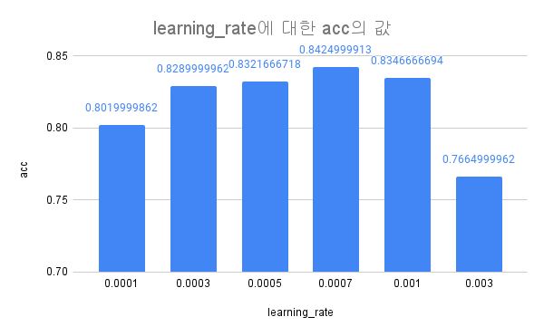
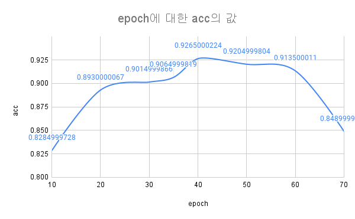
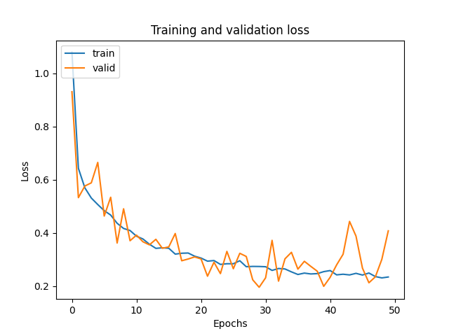

# Machine Learning: Cats and Dogs with Tensorflow

인터넷 발전과 SNS 서비스를 통한 데이터의 폭발적인 증가와 컴퓨팅 파워의 발전으로 머신러닝 기술을 바탕으로 본격적인 트레이닝을 할 수 있게 되어 많은 대규모 IT기업에서의 활용 및 지원을 하며 최근 크게 주목 받고
있다. 머신러닝 및 딥러닝의 발전 가능성과 현재 기술 트렌드에 맞춰 개와 고양이 이미지를 인식하여 분류하는 모델을 실험해보았다.  
모델 구성 및 데이터셋은 kaggle에서 제공하는 ["Dogs vs. Cats Challenge"](https://www.kaggle.com/c/dogs-vs-cats/overview)
의 ["Renga"](https://www.kaggle.com/vrenganathan) 라는 유저가 작성한 CNN모델을 바탕으로
["Cat and Dog"](https://www.kaggle.com/tongpython/cat-and-dog) 데이터셋으로 실험을 진행했다.

## Datasets

### Train & Test Set

- [Kaggle: Cat and Dog(Datasets)](https://www.kaggle.com/tongpython/cat-and-dog)

### Validation Set

- [Kaggle: Dogs vs. Cats(Challenge)](https://www.kaggle.com/c/dogs-vs-cats/overview)

### CNN modeling source code reference

- https://www.kaggle.com/vrenganathan/dog-cats-90-accuracy-with-cnn-image-aug/notebook

## Experiment

### Example(Jupyter Notebook)

- [cats_and_dogs.ipynb](./cats_and_dogs.ipynb)

### Reporting source

- [cats_and_dogs_script.py](./src/cats_and_dogs_script.py)
- [cnn.py(class)](./src/cnn.py)

## Report

### Experiment Result

- 2021.10.25
    - 92.65%

### Experiment Environment

- windows 10
- anaconda3, python 3.9
- tensorflow 2.5.0

### Hyper Parameters

|파라미터|실험 값|최적 값|
|------|---|---|
|dropout|0.1, 0.2, 0.3, 0.4, 0.5|0.3|
|learning rate|0.0001, 0.0003, 0.0005, 0.0007, 0.001, 0.003|0.0007|
|epoch|10, 20, 30, 35, 40, 50, 60, 70|40|

### Uniqueness

dropout

- 기본적으로 높아질 수록 성능이 떨어지는 것으로 보인다.
- dropout 수치에 10을 곱하여 짝수이면 성능이 낮았고 홀수면 성능이 올라갔다.

learning rate

- 0.001보다 작거나 같은 경우에 높은 성능을 보인다.
- 조정 시, 0.0001 단위로 조정하여 적합한 값을 찾는 것이 좋아 보인다.

learning rate & dropout

- dropout과 learning rate와의 상관관계를 분석하고자 하였다.
- 두 변수는 서로에게 미치는 영향이 거의 없다고 판단된다.

epoch

- 40회까지는 횟수에 비례하여 성능이 상승한다.
- 50회부터는 오히려 성능이 줄어들기 시작하며, 과적합 현상을 보인다.

### Limitations of Experiments

1. 결정적으로 표본의 수가 많이 부족하다. 생각보다 CNN 이미지 학습에 소요되는 시간이 너무 컸다.
2. 각 epoch에 따른 학습 곡선이 명확하게 과적합인지 판단하기 어려웠다. validation 결과의 오차 범위가 너무 큰 것으로 보인다.

> epoch = 40
>
> 
> 
>
> epoch = 50
>
> 
> 
>
> epoch = 60
>
> 
> 
>
> epoch = 70
>
> 
> 

### Predict

**92.65%**

> learning rate: 0.0007
>
> dropout: 0.3
>
> epoch: 40

- [555.csv](./report/555.csv)