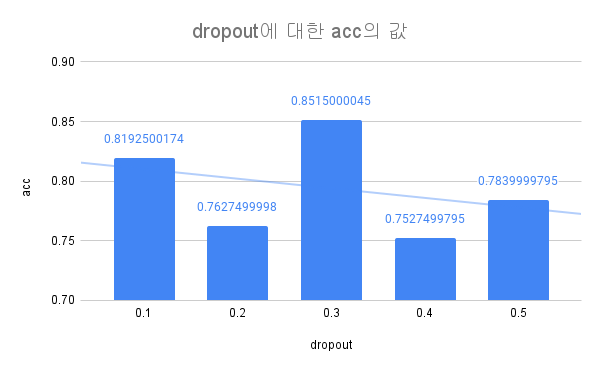
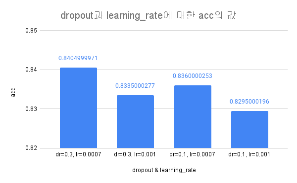

# Machine Learning: Cats and Dogs with Tensorflow

인터넷 발전과 SNS 서비스를 통한 데이터의 폭발적인 증가와 컴퓨팅 파워의 발전으로 머신러닝 기술을 바탕으로 본격적인 트레이닝을 할 수 있게 되어 많은 대규모 IT기업에서의 활용 및 지원을 하며 최근 크게 주목 받고
있다. 머신러닝 및 딥러닝의 발전 가능성과 현재 기술 트렌드에 맞춰 개와 고양이 이미지를 인식하여 분류하는 모델을 실험해보았다.  
모델 구성 및 데이터셋은 kaggle에서 제공하는 ["Dogs vs. Cats Challenge"](https://www.kaggle.com/c/dogs-vs-cats/overview)
의 ["Renga"](https://www.kaggle.com/vrenganathan) 라는 유저가 작성한 CNN모델을 바탕으로
["Cat and Dog"](https://www.kaggle.com/tongpython/cat-and-dog) 데이터셋으로 실험을 진행했다.

## Datasets

### Train & Test Set

- [Kaggle: Cat and Dog(Datasets)](https://www.kaggle.com/tongpython/cat-and-dog)

### Validation Set

- [Kaggle: Dogs vs. Cats(Challenge)](https://www.kaggle.com/c/dogs-vs-cats/overview)

### CNN modeling source code reference

- https://www.kaggle.com/vrenganathan/dog-cats-90-accuracy-with-cnn-image-aug/notebook

## Experiment

### example(Jupyter Notebook)

- [cats_and_dogs.ipynb](./cats_and_dogs.ipynb)

### reporting source

- [cats_and_dogs_script.py](./src/cats_and_dogs_script.py)
- [cnn.py(class)](./src/cnn.py)

## Report

### 실험 환경

- windows 10
- anaconda3, python 3.9
- tensorflow 2.5.0

### 하이퍼 파라미터

|파라미터|실험 값|최적 값|
|------|---|---|
|dropout|0.1, 0.2, 0.3, 0.4, 0.5|0.3|
|learning rate|0.0001, 0.0003, 0.0005, 0.0007, 0.001, 0.003|0.0007|
|epoch|10, 20, 30, 35|35|

### Chart

### predict
